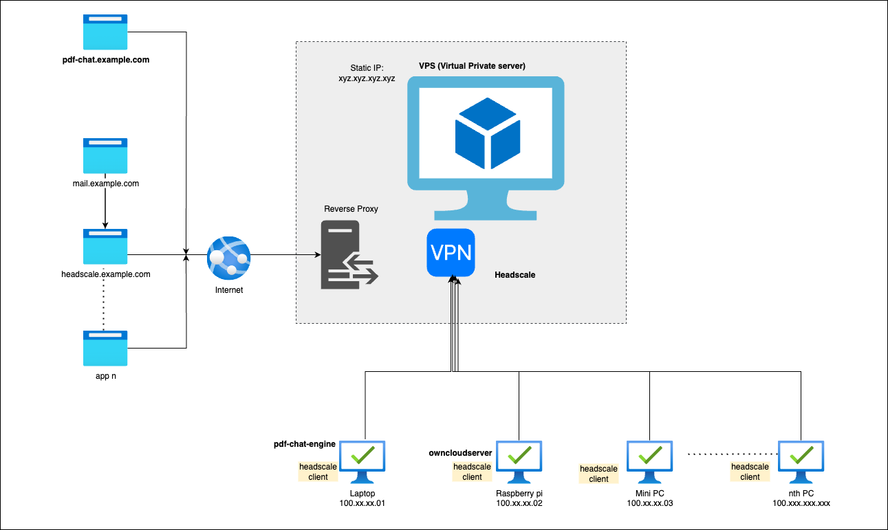
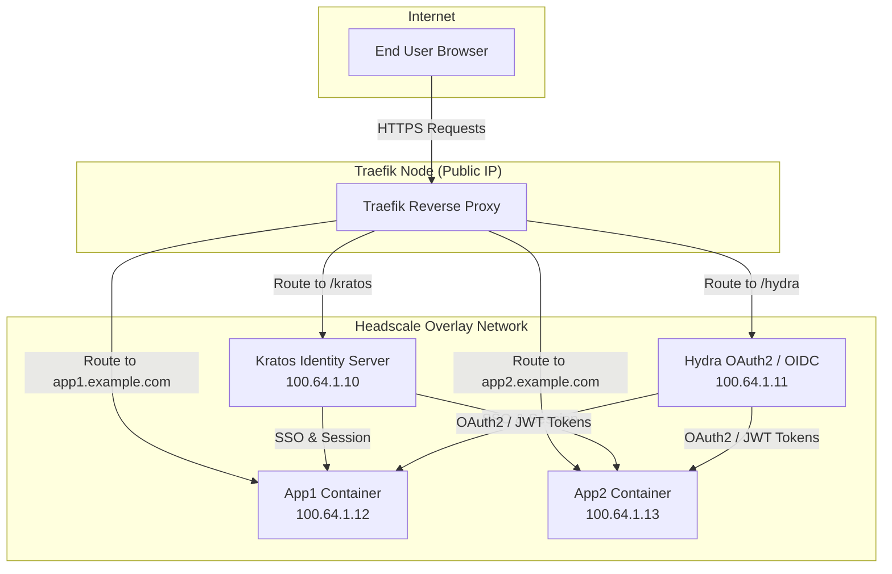

# Evolutionlab
EvolutionLab is my self-hosted mini-cloud — a living lab where a VPS, Raspberry Pis, and mini-PCs mesh together with Headscale and Traefik. Here I experiment with LLM chatbots, private cloud services, and edge-scale apps, pushing ideas from sketch to prototype. It’s an environment built to evolve fast, break limits, and spark new products.


## Architecture


Tools used
1. [Headscale](https://headscale.net/stable) v0.23 - overlay private vpn
2. [Traefik](https://doc.traefik.io/traefik/) - reverse proxy
3. [Hetzner vps](https://hetzner.cloud/?ref=yVg0m2YnO23F)*<p style="font-size:0.5rem;">get referral 20€ credit</p>
4. Tailscale client for nodes such as raspberry, laptop, etc
4. [Cloudflare](https://www.cloudflare.com) - domain manager to create multiple subdomains forwarding traffic to your vps IP.
----
This set up is independent of your vps, domain provider and domain manager. Its simple and straight forward setup
- Buy a domain and VPS, from same provider or different providers.
- Map your domain and VPS static IP, as per DNS and nameserver configuration docs of provider if neccessary.
- Use headless linux OS on your vps. As all the guidelines here linux based.
- Install docker, git and make neccessary configs on your VPS
- Clone this repo, adjust domain, subdomains in the yaml files.
- Spin up the docker compose and your lab is almost ready
- [Headscale](https://headscale.net/stable) has clear documentation to setup exit nodes, joining nodes and more.  

```bash
docker compose up -d
```
---
Join a headscale node from client cli
```bash
sudo tailscale up --login-server=<https-url> --authkey <Authkey>
```
---
# Features
 - [✓] Git based auto deployments using cronjob.
 - [✓] Current weekly auto deployments if there is any change. But configurable.
 - [✓] Host multiple domains, services can run on any your node.
 - [✓] Traefik manages dynamic routing for all your subdomain routing.
 - [✓] Auth services.
 - [ ] Automate subdomain handling on cloudflare with RESTAPI or bash

# Changes 19.Apr.2024
- migrate to traefik for more granular control


##  TO DO



# Diagram Explanation

1. ***User*** → ***Traefik***
   - Public requests hit Traefik node.
   - Traefik terminates TLS and forwards requests over VPN.

2. ***Traefik*** → ***Kratos / Hydra / Apps***
  - /kratos → Kratos API for identity management.
  - /hydra → Hydra API for OAuth2 / token issuance.
  - app1.example.com, app2.example.com → routed to respective app containers.

3. ***Kratos / Hydra*** → ***Apps***

Apps validate sessions via Kratos (SSO) and JWT tokens via Hydra.

4. ***Headscale Overlay***
   All internal traffic happens over secure VPN (100.64.x.x).


# Scope - Comparision - Strategy
## SaaS Deployment Scale Comparison

Further notes is scope documentation, compares deployment setups for **personal, medium-scale, and enterprise-scale SaaS**, focusing on infrastructure, DevOps practices, and identity/auth management.


## Enterprise-Scale SaaS

**Examples:** Amazon.com, Zalando

**Features / Requirements:**
- Multi-region, global load balancing
- Kubernetes or managed orchestration (EKS/GKE/AKS)
- Enterprise CI/CD pipelines, automated canary / blue-green deployments
- Full observability: metrics, tracing, centralized logging
- Advanced security: IAM, WAF, secrets management, auditing, compliance
- Auto-scaling, fault-tolerant multi-node deployments

**Infrastructure:**
- Cloud + container orchestration
- Managed databases
- Global DNS + CDNs

---

## Medium-Scale SaaS

**Examples:** Lucidchart, Medium, early SaaS with growing user base

**Features / Requirements:**
- Multi-app deployment (APIs, web apps)
- CI/CD pipelines (Jenkins, GitHub Actions, GitLab CI)
- Rolling / blue-green deployments, optional canary
- Observability: Prometheus/Grafana, ELK stack
- Overlay networks (VPN or VPC) for secure internal communication
- Kratos + Hydra for SSO + OAuth2 token-based auth

**Infrastructure:**
- Multiple nodes
- Traefik or API gateway
- Containerized apps

---

## Lightweight / Personal SaaS

**Examples:** Personal projects, prototypes, early-stage SaaS

**Features / Requirements:**
- Single Traefik node as public ingress
- Headscale VPN overlay connects multiple nodes
- Git-based deployment + cronjob (weekly/nightly)
- Docker Compose-based app deployment on overlay network
- Kratos + Hydra for identity, session SSO, OAuth2 token-based API access
- Apps instantly available to public once container is spun up

**Infrastructure:**
- Minimal nodes
- Low-cost, lightweight, fast iteration

---

## Key Takeaways

1. **Current Setup in the “Lightweight / Personal SaaS” tier**, cost-effective and fast to iterate.
2. **Kratos + Hydra** provide enterprise-grade SSO & OAuth2, ahead of typical personal setups.
3. **Scaling beyond medium SaaS** (e.g., Lucidchart or Amazon) requires:
   - Kubernetes or orchestration for multi-node resilience
   - Full CI/CD pipelines for automated builds & deployments
   - Observability stack for logs, metrics, tracing
   - Automated failover, multi-region routing, SLA guarantees
4. **Current deployment strategy (cron + overlay network)** is optimal when:
   - Rapid deployment of independent apps matters
   - Cost and operational overhead need to stay low
   - Traffic is moderate and single-region suffices

---

## Strategic Recommendation

- **Phase 1 (Current setup):**
  - Lightweight, secure, overlay-based deployments with Traefik + Kratos/Hydra
  - Ideal for personal projects & early SaaS

- **Phase 2 (Medium SaaS growth):**
  - Add CI/CD pipelines
  - Rolling updates / health checks
  - Monitoring and centralized logs
  - Optional Kubernetes / Swarm for app nodes

- **Phase 3 (Enterprise-scale SaaS):**
  - Multi-region Kubernetes clusters
  - Managed CI/CD with automated testing and canary deployments
  - Enterprise-grade IAM, RBAC, auditing, compliance management

---
This repo is masked and clean version of [working lab setup](https://github.com:mpaladium/zukvik).
Some services running actively
- [bytephile](https://www.bytephile.cc) - demo page to handle multiple domains.
- [zukvik](https://www.zukvik.org) - demo page
- [matchplayground](https://matchplayground.zukvik.org) - a fun LLM based profile match making chat engine.
- [owncloud](https://namabbu.zukvik.org) - private owncloud setup running on raspberry pi. currently down
- [demoservice](https://demo.zukvik.org) - to give public access and demonstrate any web based service.
- [authentication](https://accounts.zukvik.org) - Work in Progress a FIDO, web Authn based fullstack auth server.
